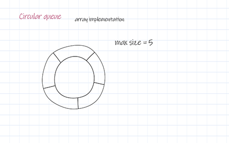

# Lecture 7: Abstract Data Type - Queue
The github for this page is:

https://github.com/itamames/Lecture7

## Queue Model  

https://docs.oracle.com/javase/8/docs/api/java/util/Queue.html

Definition: A queue is a list of elements such that:
* elements are inserted at the end of the list (the rear/back)
* deleted at the front of the list

 Queues are sometimes known as FIFO - (F)irst (I)n, (F)irst (O)ut) lists.

Operations:
* enqueue – insert at the end
* dequeue – delete the least recently inserted element

Important point:

For queues, both the linked list and array implementations give fast O(1) running times for every operation.

Advantage over Stack

Queue is an interface, which allows multiple inheritance vs stack is a class, therefore is single inheritance. 

## Implementation of Queues

For each queue, we keep:
* the positions front and back, which represent the ends of the queue;
* the number of elements that are actually in the queue, currentSize.


Image from https://www.geeksforgeeks.org/queue-using-stacks/

Operations:
```text
init
	front = 0; back = -1; currentSize = 0  
	qMaxSize   //size of queue
To enqueue (insert) an element x: 
if currentSize == qMaxSize
	Overflow Error!
else 
	currentSize +=1;
	back +=1;
	theArray[back]=x; 
To dequeue (delete) an element:
if currentSize == 0
 	Underflow Error!
else 
	return value is theArray[front];
	currentSize -=1;
	front +=1;
```
Queues can be implemented in both arraylist and linkedlist versions. Here it is implemented as a linkedlist.

```java
// Java program for linked-list implementation of queue
 
// A linked list (LL) node to store a queue entry
class QNode {
    int key;
    QNode next;
 
    // constructor to create a new linked list node
    public QNode(int key)
    {
        this.key = key;
        this.next = null;
    }
}
 
// A class to represent a queue
// The queue, front stores the front node of LL and rear
// stores the last node of LL
class Queue {
    QNode front, rear;
 
    public Queue() { this.front = this.rear = null; }
 
    // Method to add an key to the queue.
    void enqueue(int key)
    {
 
        // Create a new LL node
        QNode temp = new QNode(key);
 
        // If queue is empty, then new node is front and
        // rear both
        if (this.rear == null) {
            this.front = this.rear = temp;
            return;
        }
 
        // Add the new node at the end of queue and change
        // rear
        this.rear.next = temp;
        this.rear = temp;
    }
 
    // Method to remove an key from queue.
    void dequeue()
    {
        // If queue is empty, return NULL.
        if (this.front == null)
            return;
 
        // Store previous front and move front one node
        // ahead
        QNode temp = this.front;
        this.front = this.front.next;
 
        // If front becomes NULL, then change rear also as
        // NULL
        if (this.front == null)
            this.rear = null;
    }
}
 
// Driver code
public class Test {
    public static void main(String[] args)
    {
        Queue q = new Queue();
        q.enqueue(10);
        q.enqueue(20);
        q.dequeue();
        q.dequeue();
        q.enqueue(30);
        q.enqueue(40);
        q.enqueue(50);
        q.dequeue();
        System.out.println("Queue Front : " + ((q.front != null) ? (q.front).key : -1));
        System.out.println("Queue Rear : " + ((q.rear != null) ? (q.rear).key : -1));
    }
}

```

Code from https://www.geeksforgeeks.org/queue-linked-list-implementation/?ref=lbp


## Potential problem:

If you queue has a fixed size by design, after N enqueues, the queue appears to be full, since back is now at the last array index, and the next enqueue would be in a nonexistent position!!!

### Simple solution: 

Whenever front or back gets to the end of the array, it is wrapped around to the beginning - circular array implementation

### Circular Array Implementation of Queues




Operations:
```text
init
	front = 0; back = -1; currentSize = 0  
	qMaxSize   //size of queue

To enqueue (insert) an element x: 
if currentSize == qMaxSize
       Overflow Error!
else 
       currentSize +=1;
       back = (back + 1) mod qMaxSize;
       theArray[back]=x;  
       
To dequeue (delete) an element:
if currentSize == 0
       Underflow Error!
else 
       the return value is theArray[front];
       currentSize -=1;
       front  = (front +1) mod qMaxSize; 
```

```java

// Java program for insertion and
// deletion in Circular Queue
import java.util.ArrayList;
 
class CircularQueue{
 
// Declaring the class variables.
private int size, front, rear;
 
// Declaring array list of integer type.
private ArrayList<Integer> queue = new ArrayList<Integer>();
 
// Constructor
CircularQueue(int size)
{
    this.size = size;
    this.front = this.rear = -1;
}
 
// Method to insert a new element in the queue.
public void enQueue(int data)
{
     
    // Condition if queue is full.
    if((front == 0 && rear == size - 1) ||
      (rear == (front - 1) % (size - 1)))
    {
        System.out.print("Queue is Full");
    }
 
    // condition for empty queue.
    else if(front == -1)
    {
        front = 0;
        rear = 0;
        queue.add(rear, data);
    }
 
    else if(rear == size - 1 && front != 0)
    {
        rear = 0;
        queue.set(rear, data);
    }
 
    else
    {
        rear = (rear + 1);
     
        // Adding a new element if
        if(front <= rear)
        {
            queue.add(rear, data);
        }
     
        // Else updating old value
        else
        {
            queue.set(rear, data);
        }
    }
}
 
// Function to dequeue an element
// form th queue.
public int deQueue()
{
    int temp;
 
    // Condition for empty queue.
    if(front == -1)
    {
        System.out.print("Queue is Empty");
         
        // Return -1 in case of empty queue
        return -1;
    }
 
    temp = queue.get(front);
 
    // Condition for only one element
    if(front == rear)
    {
        front = -1;
        rear = -1;
    }
 
    else if(front == size - 1)
    {
        front = 0;
    }
    else
    {
        front = front + 1;
    }
     
    // Returns the dequeued element
    return temp;
}
 
// Method to display the elements of queue
public void displayQueue()
{
     
    // Condition for empty queue.
    if(front == -1)
    {
        System.out.print("Queue is Empty");
        return;
    }
 
    // If rear has not crossed the max size
    // or queue rear is still greater then
    // front.
    System.out.print("Elements in the " +
                     "circular queue are: ");
 
    if(rear >= front)
    {
     
        // Loop to print elements from
        // front to rear.
        for(int i = front; i <= rear; i++)
        {
            System.out.print(queue.get(i));
            System.out.print(" ");
        }
        System.out.println();
    }
 
    // If rear crossed the max index and
    // indexing has started in loop
    else
    {
         
        // Loop for printing elements from
        // front to max size or last index
        for(int i = front; i < size; i++)
        {
            System.out.print(queue.get(i));
            System.out.print(" ");
        }
 
        // Loop for printing elements from
        // 0th index till rear position
        for(int i = 0; i <= rear; i++)
        {
            System.out.print(queue.get(i));
            System.out.print(" ");
        }
        System.out.println();
    }
}
 
// Driver code
public static void main(String[] args)
{
     
    // Initialising new object of
    // CircularQueue class.
    CircularQueue q = new CircularQueue(5);
     
    q.enQueue(14);
    q.enQueue(22);
    q.enQueue(13);
    q.enQueue(-6);
     
    q.displayQueue();
 
    int x = q.deQueue();
 
    // Checking for empty queue.
    if(x != -1)
    {
        System.out.print("Deleted value = ");
        System.out.println(x);
    }
 
    x = q.deQueue();
 
    // Checking for empty queue.
    if(x != -1)
    {
        System.out.print("Deleted value = ");
        System.out.println(x);
    }
 
    q.displayQueue();
     
    q.enQueue(9);
    q.enQueue(20);
    q.enQueue(5);
     
    q.displayQueue();
     
    q.enQueue(20);
}
}
```

Code from https://www.geeksforgeeks.org/introduction-and-array-implementation-of-circular-queue/

## Queue Applications

Some simple examples of queue usage:
* When jobs are submitted to a printer, they are arranged in order of arrival. 
* Virtually every real-life line is (supposed to be) a queue: first-come first-served.
* In computer networks, users on other computers (file server) are given access to files on a first-come first-served basis. 
* Calls to large companies are generally placed on a queue when all operators are busy.
* Printer queues
* Packet router
* Simulating a queuing system
* Supermarket checkout lanes
* Highway traffic congestion models
* Internet traffic
* Priority Queues: emergency room 


# Class Practice


In this lab, you will work on a simulation that uses queues to analyze a problem for a supermarket. The manager of the supermarket wants to analyze whether there should be a separate line (queue) of customers for each cash register or a single line that serves all cash registers so that once a cash register is available, the next person on line goes directly to that cash register to check out.

## EXERCISES
Clone the github link at the start of the class.

This practice contains a Customer class that models a customer in the supermarket. Each customer keeps track of the time when the customer enters the queue and how long it will take for the customer to check out once the customer arrives at the cash register.

There are also two simulator classes, Simulation1 and Simulation2. Each simulation has three parameters, the probability that a customer arrives each minute, the number of registers in the market, and the total number of simulated minutes. The simulation then has a loop that simulates one minute of time in the market.

1) Read the comments in each Simulation class and complete the required code.

2) Run each simulator with the given parameters and see what the average waiting time is for a customer. Then increase the arrival probability by 0.1 at a time and look at the average waiting time. (The probability should not exceed 1.0 total.) 

3) Try to decide which queue policy is better for the customers.
